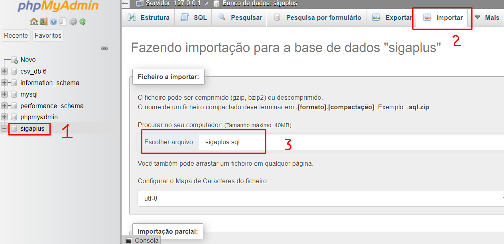
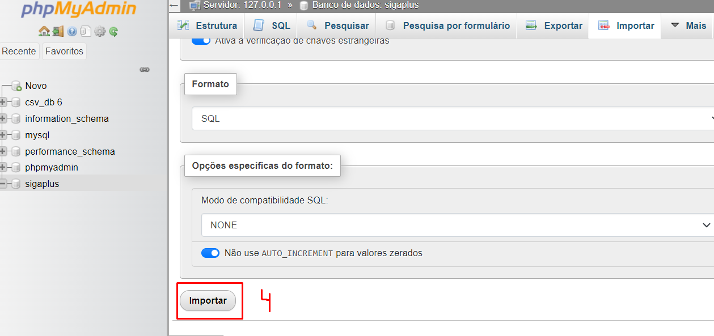

# trabalho-banco-de-dados

## Resumo 📜

&emsp; Siga Plus é um projeto criado na disciplina de Banco de Dados da UFJF, com o objetivo de modelar, projetar e desenvolver uma plataforma para cadastro de informações da faculdade. Como por exemplo cadastro de alunos,professores, cursos, disciplinas, reitores, coordenadores e etc.

&emsp; Após a criação do modelo lógico, modelo relacional, algebra relacional, foi desenvolvido uma interface utilizando HTML e PHP, como forma de um protótipo que contém 4 telas diferenes( Alunos, Professore, Curso, Curso_Aluno) que ilustra como ficaria o projeto final.

---

## Executar projeto 💻

&emsp; Para executar o projeto, é necessário criar/popular o banco de dados e hospedar o projeto PHP em um servidor. Para facilitar a execução, abaixo está o passo a passo que utilizamos para rodar o projeto:

 

**1) Iniciar XAMPP**

&emsp; Para criar um servidor local que hospede o banco de dados e o projeto PHP, optamos por utilizar o [XAMPP](https://www.apachefriends.org/pt_br/index.html).

&emsp; Com o XAMPP instalado no computador, basta iniciar as opções Apache e Mysql, apertando nos seus respectivos botões 'Start':    

 

**2) Criar o banco de dados**

&emsp; Com essas duas opções ativadas no XAMPP, podemos acessar o banco de dados local através da seguinte url: http://localhost/phpmyadmin/

&emsp; Após carregar a tela do phpMyAdmin, basta selecionar a opção 'Novo' e inserir o nome do banco de dados '**sigaplus**' no input marcado na imagem abaixo. Feito isso, basta clicar no botão 'Criar'    

 

**3) Inserir dados no banco de dados**

&emsp; Com o banco de dados criado, o próximo passo é criar suas tabelas, colunas e inserir registros. Para isso, podemos apenas importar todos esses dados já contidos no arquivo [sigaplus.sql](./sigaplus.sql).

&emsp;Basta selecionar o banco criado 'sigaplus' (1), selecionar a opção 'Importar' (2), escolher o arquivo _sigaplus.sql_ (3) e finalizar clicando no botão 'Importar' (4).
  

 

**4) Hospedar projeto PHP**

&emsp; Agora que já temos o banco de dados funcionando, podemos hospedar o projeto com dois passos:

&emsp; O primeiro passo é procurar no computador a pasta **htdocs** criada na instalação do XAMPP e após encontrar, o segundo passo é colocar o projeto [sigaplus](./sigaplus/) (presente nesse repositório) dentro dessa pasta htdocs:   

 

**5) Abrir interface no navegador**

&emsp; Com os 4 passos anteriores realizados, o projeto já está funcionando em localhost. Acessando a url `localhost/:nome_da_pasta:` . No caso, como a pasta se chama sigaplus, o projeto está hospedado localmente nesse link: http://localhost/sigaplus/
  

 
